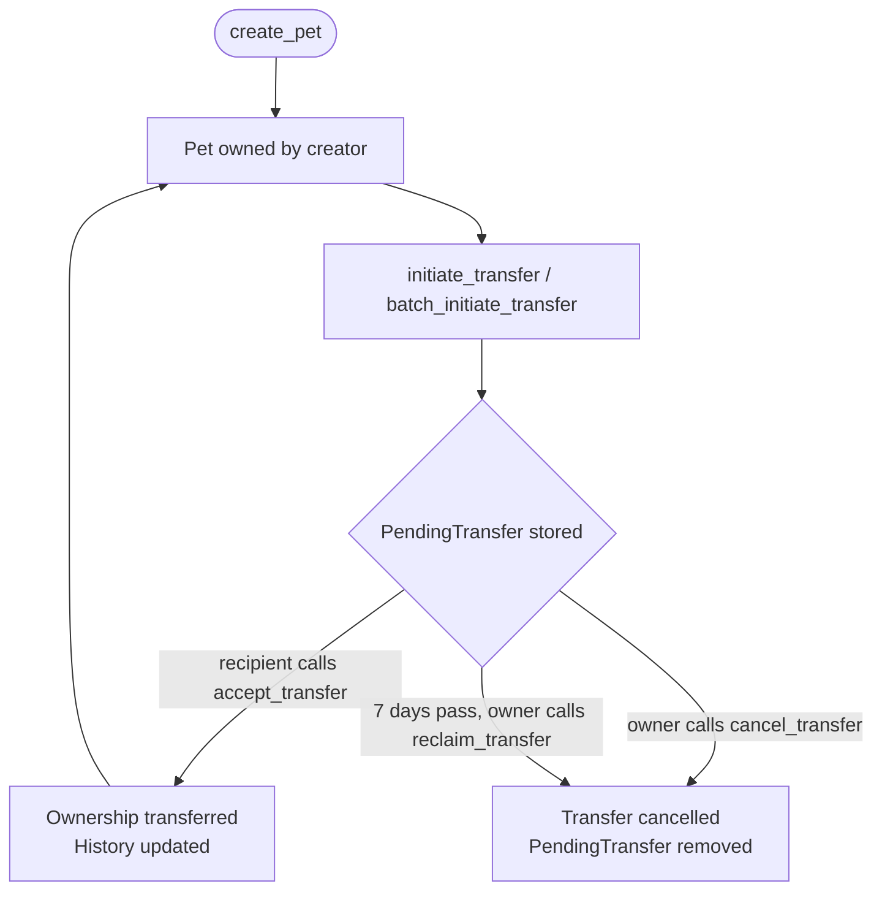
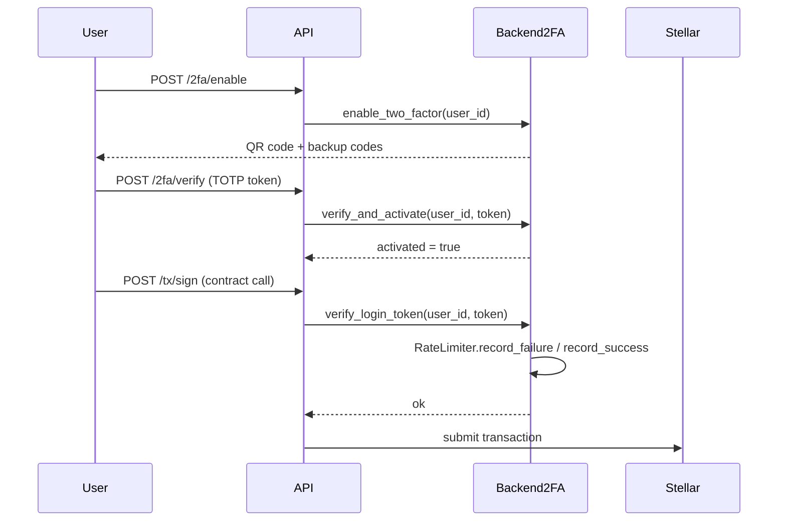

# Architecture

This document explains the overall structure of PetChain-Contracts, how the components relate to each other, and the reasoning behind key design decisions.

---

## Repository Layout

```
PetChain-Contracts/
├── stellar-contracts/                  # Soroban smart-contract workspace
│   ├── Cargo.toml                      # Workspace manifest
│   └── contracts/
│       └── pet_transfer_adoption/      # Ownership transfer contract
│           ├── src/
│           │   ├── lib.rs              # PetOwnershipContract
│           │   ├── vet_registry.rs     # VetRegistryContract
│           │   └── test.rs             # Unit tests
│           └── Cargo.toml
└── backend-2fa-implementation/         # Standalone Rust 2FA service
    ├── src/
    │   ├── lib.rs                      # Public API
    │   ├── two_factor.rs               # TOTP core logic
    │   ├── rate_limiter.rs             # Pluggable rate limiting
    │   ├── handlers.rs                 # Business-logic layer
    │   ├── db.rs                       # PostgreSQL store
    │   └── tests.rs                    # Test suite
    └── Cargo.toml
```

---

## Smart Contracts

### `PetOwnershipContract` (`lib.rs`)

Manages the lifecycle of pet ownership on the Stellar network.

**Responsibilities**

| Function | Purpose |
|---|---|
| `create_pet` | Bootstrap a pet record with an initial owner |
| `initiate_transfer` | Place a single pet into a pending-transfer state |
| `batch_initiate_transfer` | Atomically initiate transfers for multiple pets |
| `accept_transfer` | Recipient claims ownership; updates history |
| `cancel_transfer` | Sender cancels before the recipient accepts |
| `reclaim_transfer` | Sender cancels after the 7-day expiry window |
| `get_current_owner` / `get_owner_pets` | Read-only queries |

**Transfer lifecycle**



**Atomicity guarantee for batch transfers**

`batch_initiate_transfer` uses a two-pass design:

1. **Validation pass** — reads all pets, checks ownership uniformity and no existing pending transfers. No writes occur, so any panic in this phase leaves storage untouched.
2. **Auth** — `require_auth()` is called once on the discovered owner.
3. **Write pass** — all `PendingTransfer` entries are written and events emitted.

Because the Soroban host rolls back all storage mutations on a contract panic, a failure at any point leaves the ledger in its original state.

---

### `VetRegistryContract` (`vet_registry.rs`)

A companion contract embedded in the same crate that manages veterinarian credentials.

**Responsibilities**

| Function | Purpose |
|---|---|
| `init` | Set the admin address (called once) |
| `register_vet` | Self-registration by a vet address |
| `verify_vet` | Admin marks a vet as verified |
| `revoke_vet_license` | Admin revokes a license |
| `get_vet` / `is_verified_vet` | Read-only queries |
| `list_vets` | Paginated listing with offset + limit |

---

## Data Model

### Core Structs

```
Pet
├── pet_id: u64           ← primary key
└── current_owner: Address

PendingTransfer
├── pet_id: u64
├── from: Address         ← must match Pet.current_owner at accept time
├── to: Address
└── initiated_at: u64     ← ledger timestamp (seconds)

OwnershipRecord           ← one entry per ownership period
├── owner: Address
├── acquired_at: u64
└── relinquished_at: Option<u64>

Vet
├── address: Address      ← primary key
├── name: String
├── license_number: String
├── specialization: String
└── verified: bool
```

### Relationships

```
Address ──< OwnerPets >── Pet ──< OwnershipHistory >── OwnershipRecord
                           │
                           └──< PendingTransfer (0 or 1)
```

---

## Storage Strategy

Soroban offers two durability tiers. This codebase uses them as follows:

| Tier | Characteristics | Used for |
|---|---|---|
| **Persistent** | Survives ledger archival; higher fee | Pet records, pending transfers, ownership history, owner→pet indexes |
| **Instance** | Lives as long as the contract instance | Not used in this contract (all state is long-lived) |

### Key Schema (`DataKey` enum)

All storage keys are typed via the `DataKey` enum annotated with `#[contracttype]`. This prevents key collisions and enables Soroban's native serialisation.

```rust
enum DataKey {
    Pet(u64),                   // Pet record
    PendingTransfer(u64),       // Outstanding transfer for a pet
    OwnershipHistory(u64),      // Vec<OwnershipRecord> per pet
    OwnerPets(Address),         // Vec<u64> of pet IDs per owner
}
```

**Index maintenance** — `OwnerPets(Address)` is a denormalised index kept in sync by every write that changes ownership (`create_pet`, `accept_transfer`). `add_pet_to_owner` deduplicates on insert; `remove_pet_from_owner` rebuilds the list on removal.

---

## Encryption Approach

Sensitive fields (pet names, owner contact details, medical alerts) are stored as `EncryptedData`:

```rust
struct EncryptedData {
    nonce: Bytes,       // Random nonce, unique per encryption
    ciphertext: Bytes,  // AES-GCM encrypted payload
}
```

**Key derivation** — Keys are derived at runtime from a domain separator, the contract's own address, and an admin-controlled context. A global `EncryptionNonceCounter` (instance storage) ensures nonce uniqueness across calls. The key material never appears in ledger storage.

The `pet_transfer_adoption` contract itself does not encrypt data — encryption is applied at the main contract layer (`stellar-contracts/src/lib.rs`) for fields that require confidentiality.

---

## Multisig Design

High-stakes operations (contract upgrades, admin transfers) are gated behind an on-chain multisig mechanism rather than a single admin key.

**Key types**

```
MultisigConfig
├── pet_id: u64          ← scope: per-pet or global
├── signers: Vec<Address>
└── threshold: u32        ← minimum approvals required

PetTransferProposal
├── proposal_id: u64
├── pet_id: u64
├── new_owner: Address
├── signatures: Vec<Address>
├── created_at: u64
└── expires_at: u64
```

**Flow**

1. Any signer creates a proposal (stored on-chain).
2. Other signers call `approve` — their address is added to `signatures`.
3. Once `signatures.len() >= threshold`, anyone can call `execute`.
4. Proposals expire after a configurable window to prevent stale approvals from executing.

---

## 2FA Integration with the Backend

`backend-2fa-implementation` is a Rust library that the PetChain API server embeds. It does not live on-chain; it provides the authentication layer that guards actions before they reach the contract.

### Component Roles

```
API Server
    │
    ├── TwoFactorHandlers       ← business logic (enable, verify, login, recover)
    │       │
    │       ├── TwoFactorStore (trait) ── InMemoryStore (dev) / PostgresTwoFactorStore (prod)
    │       │
    │       └── RateLimiter (trait) ──── InMemoryRateLimiter (dev)
    │                                    RedisRateLimiter (prod)
    │
    └── Stellar SDK  ──→  PetOwnershipContract (on-chain)
```

### TOTP Flow



### Rate Limiter Trait

The `RateLimiter` trait is the only seam between the business logic and the persistence backend:

```rust
pub trait RateLimiter: Send + Sync {
    fn record_failure(&self, key: &str) -> RateLimitResult;
    fn record_success(&self, key: &str);
}
```

Swapping `InMemoryRateLimiter` for `RedisRateLimiter` in production requires only changing the concrete type passed to `TwoFactorHandlers::with_limiter(...)`. No handler code changes.

**Rate limit key convention** — keys follow the pattern `{action}:{user_id}` (e.g. `login:user123`, `verify:user123`) so that different operations have independent counters per user.

---

## Error Handling

### Smart Contracts

Errors are declared with `#[contracterror]` and a `#[repr(u32)]` discriminant. Callers inspect the `u32` error code via `Error::from_contract_error`. The `panic_with_error!` macro aborts execution and rolls back all state changes for the current invocation.

```
1  PetNotFound
2  Unauthorized
3  TransferAlreadyPending
4  NoPendingTransfer
5  InvalidRecipient
6  EmptyOwnershipHistory
7  MissingOwnershipRecord
8  TransferNotExpired
9  StaleCancellation
10 EmptyBatch
11 BatchOwnerMismatch
```

### 2FA Backend

Functions return `Result<T, String>` where the error string is a human-readable message forwarded to the API client. Rate-limit failures surface as `Err("Too many failed attempts. Retry after N seconds.")`. The `RedisRateLimiter` fails open on connectivity errors — it logs to stderr but returns `Allowed` to avoid blocking users during Redis outages.

---

## Testing Strategy

| Layer | How |
|---|---|
| Contract unit tests | `soroban_sdk::testutils` with `mock_all_auths()` — no network required |
| Backend unit tests | Pure Rust, `InMemoryStore` + `InMemoryRateLimiter` |
| Backend integration | Real Postgres (`DATABASE_URL`) / Redis (`REDIS_URL`), marked `#[ignore]` |
| Contract build check | `cargo build --target wasm32-unknown-unknown --release` |
| Security audit | `cargo audit` in CI |

Coverage target: **> 90%** for all public functions.
